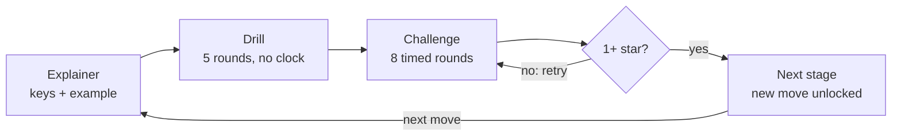

# Vim Dojo — Specification

**Status:** prototype spec, version 0.3 (2026-10-07). This file is the source of
truth for how the game behaves. How to change it: see [AGENTS.md](AGENTS.md).
Why things are the way they are: [docs/decisions/](docs/decisions/).

## 1. Summary

Vim Dojo is a Neovim plugin that teaches Vim motions as a game: learn one move,
drill it, then beat a timed challenge that mixes it with every move learned so
far. Every round counts your keystrokes against **par**, the shortest solution
using the moves you know. Stumbling through still passes; mastery earns stars.

The prototype has 14 stages in four worlds, about 45–60 minutes of play. It runs
in a pinned, locked-down Docker container, or as a plugin in any Neovim ≥ 0.12.

## 2. Background and inspiration

Vim Dojo started from trying two training plugins side by side, then borrowed
the teaching order and habit-breaking ideas from four more projects. Nothing is
copied; every source is credited in [docs/references.md](docs/references.md).

| Source | What we take | What we avoid |
| --- | --- | --- |
| [vim-be-good](https://github.com/ThePrimeagen/vim-be-good) | Time pressure that forces moves from memory; menu and rounds that feel like a game | Small scope (7 games); clumsy solutions pass if they are fast; `ci{` never explained |
| [nvim-training](https://github.com/Weyaaron/nvim-training) | Breadth (60+ tasks, topic collections); being strict about *how* a task is solved | Tasks that assume untaught combinations and feel like puzzles; no time pressure |
| vimtutor (Neovim `:Tutor`) | The lesson order (move, `x`, insert, `A`, operator + motion, counts, `dd`, `c`) and checking lines against expected text | Long reading; no scoring or repetition |
| [learn-vim](https://github.com/dofy/learn-vim) | Grouping motions by size (cell, word, line) and "estimate a count, then correct" | — |
| [hardtime.nvim](https://github.com/m4xshen/hardtime.nvim) | Hints that name a better command after an inefficient one; its recommended motion workflow | Blocking keys in everyday editing |
| [delaytrain.nvim](https://github.com/ja-ford/delaytrain.nvim) | Gently blocking a key that is repeated too often within a short time | — |

## 3. Goals and non-goals

Goals for the prototype:

- Prove the loop: explainer, drill, timed challenge, with keystroke stars.
- Never a puzzle: no round needs a move the player has not been shown.
- Correct par every time: equal to the shortest solution using learned moves.
- After every round, show the intended solution and up to two alternatives in
  Vim key notation.
- Random rounds: distances, words and target characters differ every time.
- Saved progress; playable in the locked-down Docker container.

Non-goals for this version:

- Animated demos; key notation is enough.
- Content beyond the 14 stages (text objects, search, yank/put, visual mode,
  registers and macros come later).
- Difficulty settings, sound, long-term statistics, spaced repetition.
- Personal Neovim configs and custom keymaps; the game assumes stock Neovim.
- Plain Vim.

## 4. Core loop

Each stage teaches one move in three steps; passing its challenge unlocks the
next stage.

1. **Explainer.** One screen: what the move does, its keys in Vim notation, a
   before/after example and a tip. Shown automatically the first time; can be
   reopened from the menu.
2. **Drill.** 5 rounds that need the new move. No timer, free hints, no stars.
   Required once before the challenge; replayable any time.
3. **Challenge.** 8 timed rounds mixing every move learned so far. Earns 0–3
   stars; 1 star unlocks the next stage.



Every challenge is cumulative, so each one already works as a "boss level" for
everything before it. Stages are grouped into worlds only for the menu. Any
unlocked stage can be replayed to improve its stars; the best result is kept.

**Challenge composition** (8 rounds): 4 use the new stage's move. From stage 2.4
on, 2 are two-step rounds (see §5). The rest are drawn uniformly from earlier
stages, generated with everything learned so far, so old moves meet new ones
(for example a `d{motion}` round may need `dt,` once `t` is known). Stage 1.1
draws all 8 from itself. Order is shuffled.

## 5. Rounds

A round is one small task in a scratch buffer: reach a target or make an edit,
and the next round starts on its own.

**Task kinds.**

- *Move rounds:* put the cursor on the highlighted target. The buffer is
  read-only, so accidental edits fail and only cost keystrokes. Checked: cursor
  position.
- *Edit rounds:* make the text match the goal. The part to change is
  highlighted, and the goal line is shown as a ghost line under it. Checked:
  text only, so where the cursor ends up does not matter. Undo (`u`) is allowed
  and costs keys like anything else.
- *Two-step rounds:* in challenges from stage 2.4 on, the target is on another
  line, so solving it needs a vertical and a horizontal move (`3j` then `2w`).

**Randomness.** Every round comes from a seeded generator: words from a word
list, start and target positions, distances, target characters. Constraints
keep rounds fair: prose lines hold only lowercase words and single spaces until
World 4 introduces code-like lines with punctuation. The seed is shown in the
summary, so any round can be reproduced.

**When a round ends.** The game checks the state after every key, but only in
Normal mode with no operator or count pending. A match is a success; running
out of time is a fail. So a move round succeeds the moment the cursor lands on
the target, and an edit round only after `<Esc>`.

**Counting keystrokes.** Each typed key counts as one, as written in Vim
notation: `3w` is 2, `f(` is 2, `cwbar<Esc>` is 6, `W` is 1. `:` commands count
every character including `<CR>`. Not counted: `<Esc>` pressed while already in
Normal mode, the game's control keys, and keys blocked by habit mode.

**Timer.** Challenges only. The limit is 5 s plus 1 s per key of par: `3w` gets
7 s, `ct)foo<Esc>` gets 12 s. The countdown in the header turns to a warning
color in the last 2 s, and each challenge opens with a 3-2-1 countdown.

**Controls during a round.**

| Key | Action |
| --- | --- |
| `<Tab>` | Hint: shows the intended solution. In a challenge, that round can then earn at most 1 star. |
| `:q` | Back to the menu (it closes the play window; the header window becomes the menu). An unfinished drill or challenge is discarded. |

Everything else is plain Neovim, with relative line numbers on and the mouse
off.

**Habit mode** (optional, after delaytrain.nvim). Off by default; toggled with
`H` in the menu and saved. In stages where counts are already learned (2.4 and
later, including their challenges), pressing the same one of `h j k l w b e` a
third time within 1 s is blocked: the key does nothing, is not counted, and the
header suggests the counted form. Before counts are taught it never blocks,
because repeating keys is then the correct answer.

## 6. Scoring

Par is the fewest keystrokes that solve a round using only learned moves; stars
reward getting close to it without punishing a clumsy solve.

**Par and solutions.** A solver (§9) computes par for every round, the intended
solution, and up to two alternatives within par + 2 keys. Among equally short
solutions, the one using the round's own stage move is preferred. In drills the
intended solution must use the new move; rounds where it doesn't are thrown
away and regenerated. Beating par with a move not yet taught is allowed and
shown as "under par".

**Round stars.**

| Result | Stars |
| --- | --- |
| Solved in par keys or fewer, no hint | 3 |
| Solved in up to par + 2 keys, no hint | 2 |
| Solved with more keys, or with the hint | 1 |
| Time ran out | 0 |

**Challenge stars.** The challenge score is the average of its round stars
(0 to 3).

- 1 star (pass): at least 75 % of rounds solved (6 of 8). Unlocks the next stage.
- 2 stars: pass, and a score of 2.0 or more.
- 3 stars: pass, and a score of 2.75 or more (for example 6 rounds at par and 2
  at par + 1).

**Habit hints** (after hardtime.nvim). Once counts are learned, a run of three
or more identical presses of `h j k l w b e x` in a round produces a hint naming
the counted form, for example `jjjj → 4j`. It appears with the round's result
and in the summary.

**Feedback.** After a success the next round starts after 0.4 s; after a fail,
the intended solution is shown and the next round starts after 1.5 s. The
previous round's result stays in the header during the next one, for example
`✓ 3 keys · par 2 · ★★ · intended 3w`. The summary after every drill and
challenge lists each round: your keys, the intended solution and alternatives.

## 7. Curriculum

The order follows vimtutor's first three lessons, regrouped by the size of the
move as learn-vim does, plus `f`/`t`, which vimtutor leaves out but every other
source treats as essential. Explainer texts are written for this game.

**World 1 · First steps** (vimtutor lesson 1)

| Stage | Keys | Round kind | Rounds look like |
| --- | --- | --- | --- |
| 1.1 | `h` `j` `k` `l` | move | Target 1 to 3 cells away, sometimes in two directions |
| 1.2 | `x` | edit | Delete 1 to 3 highlighted stray letters |
| 1.3 | `i` `a` | edit | Insert a missing word or letters next to the cursor |
| 1.4 | `A` `I` | edit | Add a missing word at the end or start of the line |

**World 2 · Words and lines** (vimtutor 2.3–2.4, learn-vim chapter 1)

| Stage | Keys | Round kind | Rounds look like |
| --- | --- | --- | --- |
| 2.1 | `w` `b` | move | Start of a word 1 to 4 words away, either direction |
| 2.2 | `e` | move | Last letter of a word 1 to 4 words ahead |
| 2.3 | `0` `^` `$` | move | Start, first non-blank (indented lines) or end of the line |
| 2.4 | counts: `4j` `3w` `3x` | move, edit | Targets 3 to 8 lines or 3 to 6 words away; 3 to 4 stray letters |

**World 3 · Operators** (vimtutor 2.1–2.6, 3.3–3.4)

| Stage | Keys | Round kind | Rounds look like |
| --- | --- | --- | --- |
| 3.1 | `d{motion}`: `dw` `de` `d$` `d0` `db` `d2w` | edit | Delete a highlighted span that one learned motion covers |
| 3.2 | `dd` `3dd` | edit | Delete 1 to 4 highlighted lines |
| 3.3 | `c{motion}`: `cw` `ce` `c$` | edit | Replace a highlighted word or line end with the goal text; the explainer covers the trap that `cw` acts like `ce` |

**World 4 · Find in the line** (learn-vim chapter 2, hardtime's workflow)

| Stage | Keys | Round kind | Rounds look like |
| --- | --- | --- | --- |
| 4.1 | `f` `F` | move | A character 6 to 40 columns away on a code-like line |
| 4.2 | `t` `T` | move | The cell just before or after a punctuation mark |
| 4.3 | `dt,` `df)` `ct)` `cf,` | edit | Delete or change up to a punctuation mark |

Long hops with `l` stop being the best answer once `w`, `e` and `f` arrive. The
solver picks that up on its own, so older stages get harder in later challenges
without extra content.

## 8. Screens

All screens are plain text inside Neovim, in their own tab page, laid out to
fit an 80 × 24 terminal. Layouts show content and placement, not final wording.

**Menu.** Opens with `:Dojo`. `j`/`k` (and `gg`/`G`) move between stages;
`<CR>` continues the stage from where it is: explainer, then drill, then
challenge. Returning to the menu puts the cursor back on the stage just played.

```
 VIM DOJO                                     8 / 42 ★   habit mode: off

 World 1 · First steps
     1.1  h j k l        ★★★
     1.2  x              ★★★
     1.3  i a            ★★☆
   > 1.4  A I            ☆☆☆   new
 World 2 · Words and lines
     2.1  w b            locked
 ...

 <CR> play   d drill   c challenge   ? explainer   H habit mode   q quit
```

**Explainer.** One screen per stage; brackets mark the cursor in examples.

```
 2.1  w b  ·  Jump by words

 w     forward to the start of the next word
 b     back to the start of the previous word

 Example
     [t]he quick brown fox jumps
     ww
     the quick [b]rown fox jumps

 Tip: watch the word starts, not the letters.

 <CR> start the drill      q menu
```

**Round.** The header sits in its own window above the play buffer; it cannot
be focused or edited. The play buffer holds only the task text, with relative
line numbers. The target is highlighted (not visible in this sketch).

```
 2.1 w b · Challenge          round 3/8          par 2       4.2 s left
 Move to the highlighted character
 Learned: h j k l  x  i a  A I  w b
 Last: ✓ 3 keys · par 2 · ★★ · intended 2w
 ───────────────────────────────────────────────────────────────────
   2  lorem ipsum dolor sit amet consectetur adipiscing
   1  elit sed do eiusmod tempor incididunt ut labore
   3  et dolore magna aliqua ut enim ad minim veniam
```

**Summary.** After every drill and challenge; the main learning moment.

```
 2.4 counts · Challenge complete                   ★★☆   score 2.25

 Solved 7/8 · at par 4/8 · average 3.4 s · seed 48121

  #   your keys    par   intended   also works    stars
  1   3w           2     3w         www           ★★★
  2   jjjjj        2     5j         –             ★     jjjjj → 5j
  3   jjjww        4     3j2w       3jww          ★★    jjj → 3j
  4   wwww         2     5w         –             time out
  …

 r retry      n next stage      m menu
```

## 9. Technical design

A Neovim plugin in plain Lua with no dependencies, built and played inside a
pinned Docker container.

**Platform.** Neovim 0.12.5, pinned and checksum-verified in the Docker image
and in CI. Lua only. Inside the container: stock config, relative line numbers,
no mouse.

**How par is found.** The solver runs candidate keys for real in a hidden
scratch buffer (`normal!`) and searches outward from the start, cheapest first
(uniform-cost search), until it reaches the goal. This avoids re-implementing
Vim's motion rules, which is where hand-written par goes wrong (`cw` acting like
`ce`, `e` on one-letter words, `j` keeping the column after `$`).

- Cost is counted in keys, not commands: a count prefix costs its digits. (A
  first test that counted commands found `2k9b` where `3kw` is a key shorter.)
- State is the text, cursor and wanted column (`curswant`), so `$` then `j` is
  modelled correctly.
- Candidates are only learned moves and `f`/`t` targets taken from characters
  on the current line (not space). Counts are 2–9 for `j k w b e`, where
  relative numbers and word starts make them easy to see, but only 2–4 for
  `h l x`: nobody counts letters at a glance, and `7x` should not beat `dt,`
  ([decision 0007](docs/decisions/0007-count-limits.md)).
- Commands that end in Insert mode (`i a A I c…`) are tried as finishers: the
  solver inserts a sentinel to learn where typing would start and works out the
  text to type from the goal. Generators therefore only describe goal text.
- Edits are only tried on the lines being changed and near the changed columns;
  after an edit the text must still be "goal prefix + rest + goal suffix",
  otherwise the branch is dropped.
- Pruning keeps it fast: a lower bound on the keys still needed (a change
  needs at least a command, the new text and `<Esc>`) drops hopeless branches;
  once `c` is learned, delete-then-insert is not explored; operators with
  `f`/`t` only target characters at the edges of the changed text.
- Ties are broken by: uses the round's focus move, then fewer commands, then key
  order.
- Alternatives: the same search with the intended solution's main move banned,
  and with counts banned.
- Measured on 0.12.5: the slowest of 200 rounds per stage takes under 200 ms
  (most take under 10 ms). Rounds are generated one ahead, during the pause
  between rounds.

**What happens in a round.**

1. The stage's generator builds the lines, start cursor and goal from a seed.
2. The solver returns par, the intended solution and alternatives. The session
   retries generation if a constraint fails (no solution within the cost limit,
   or a drill round whose best solution skips the new move).
3. The round runner shows the buffer and header, records typed keys with
   `vim.on_key`, runs the timer, and checks the state after each key.
4. The scorer turns keys, time and hint use into round stars and habit hints;
   the session adds them up.
5. Progress is saved after every finished drill or challenge.

**Code layout.**

| Path | Responsibility |
| --- | --- |
| `plugin/dojo.lua` | Defines `:Dojo` |
| `lua/dojo/init.lua` | `setup(opts)` and `open()` |
| `lua/dojo/config.lua` | All tunable defaults (§10) |
| `lua/dojo/curriculum.lua` | Worlds, stages, their order, learned moves |
| `lua/dojo/stages/s<world>_<n>.lua` | One file per stage: explainer and round generator (`twostep.lua` for two-step rounds, `util.lua` helpers) |
| `lua/dojo/solver.lua` | Par, intended solution, alternatives |
| `lua/dojo/moves.lua` | Move families and the candidate keys they allow |
| `lua/dojo/round.lua` | One round: buffer, key capture, habit mode, timer, completion check |
| `lua/dojo/session.lua` | Drill and challenge sequencing |
| `lua/dojo/score.lua` | Star rules, habit hints |
| `lua/dojo/ui/*.lua` | Layout, menu, explainer, header and summary screens |
| `lua/dojo/progress.lua` | Saving and loading progress, round log |
| `lua/dojo/rng.lua`, `words.lua`, `text.lua`, `keys.lua` | Seeded random numbers, word list, line builders, key display |
| `tests/` | Headless test suite (`nvim -l tests/run.lua`) |
| `docker/`, `compose.yaml` | Container image and services |

**Stage files** are the main extension point. Each returns a table with `id`,
`title`, `name`, `kind`, `adds` (move families it teaches), `focus` (which
families a solution must use), `explainer`, and `generate(rng, ctx)`. That
function returns `{kind, lines, cursor, goal}` where `goal` is a cursor for
move rounds or goal lines for edit rounds, plus a one-line `prompt`. `ctx` says
which families are learned and whether it is a drill or a challenge.

**Saved data** lives in `stdpath('data')/dojo/`. `progress.json` holds, per
stage: explainer seen, drill done, best stars, best score, attempts; plus
settings (habit mode). `rounds.jsonl` logs every round (stage, mode, seed, keys,
par, time, result) for statistics later.

**Docker.** No network, read-only filesystem, no capabilities, non-root user, a
data volume. The plugin is copied from the repo at build time. Services:
`dojo` (play), `dev` (repo mounted read-only, no rebuild needed), `test` (runs
the suite).

**Tests** run headless with `nvim -l tests/run.lua`, a small runner of our own.

- Every stage, 200 seeds (drill and challenge context): the intended solution
  and every alternative, replayed with real keys, reach the goal; the intended
  solution is par keys long; drill solutions use the stage's move.
- Solver cases with known answers (`3w`, `$`, `3kw`, `dt,`, `cebar<Esc>`).
- Round runner: keys fed with `nvim_feedkeys`, asserting key count, success,
  timeout and habit-mode blocking.
- Star rules, unlock rule, saving then loading progress.
- Solver time per round stays within budget.

**CI** (GitHub Actions): the test suite on the pinned Neovim, and a Docker build
that runs the suite inside the image.

## 10. Tunable defaults

Every number that shapes difficulty lives in `lua/dojo/config.lua`, overridable
through `require("dojo").setup()`, because playtesting will move most of them.

| Setting | Default |
| --- | --- |
| Rounds per drill | 5 |
| Rounds per challenge | 8 |
| Challenge rounds using the new move | 4 of 8 |
| Two-step rounds per challenge (from stage 2.4) | 2 of 8 |
| Time limit per challenge round | 5 s + 1 s per par key |
| Warning color | last 2 s |
| 2-star round | up to par + 2 keys |
| Pass (1 star, unlocks next stage) | 75 % of rounds solved |
| 2-star challenge | pass and score ≥ 2.0 |
| 3-star challenge | pass and score ≥ 2.75 |
| Hint in a challenge | round earns at most 1 star |
| Pause after a success / fail | 0.4 s / 1.5 s |
| Habit mode | off; blocks 3rd press within 1000 ms |
| Habit hint | run of 3+ identical presses |
| Solver cost limit | 10 keys for move rounds, 16 for edit rounds |
| Counts the solver tries | 2–9 for `j k w b e`, 2–4 for `h l x` |
| Seeds per stage in tests | 200 |

## 11. Acceptance criteria

The prototype is done when all of these hold:

- [ ] `docker compose run --rm dojo` opens the menu; on first start only stage
  1.1 is unlocked.
- [ ] All 14 stages play end to end: explainer, drill, challenge, summary.
- [ ] A passed challenge unlocks the next stage, and progress survives
  restarting the container.
- [ ] Every round shows the target, par and learned moves, plus the countdown in
  challenges.
- [ ] After every round and in every summary: your keys, the intended solution
  and alternatives.
- [ ] Test suite passes locally and in CI: every stage solvable at par across
  200 seeds, and drills always need the new move.
- [ ] Solver stays within budget, measured in the tests.
- [ ] A full playthrough leaves no errors in `:messages`; the layout works at
  80 × 24.
- [ ] Habit mode blocks repeats only where counts are learned; habit hints
  appear in results and summaries.

## 12. Open questions

- **License.** The repo is public but has no license yet, so by default nobody
  may reuse it. All referenced projects are permissive (CC0, MIT, Apache-2.0,
  Vim license) and no code or text was copied. Owner's choice; MIT or Apache-2.0
  would match the references.

Resolved questions from version 0.1 are recorded in
[docs/decisions/0006-prototype-defaults.md](docs/decisions/0006-prototype-defaults.md).

## 13. After the prototype

If playtesting confirms the loop, later worlds reuse the engine and only add
stage files:

1. Put, replace, yank and open lines: `p` `r` `R` `y` `o` `O` (vimtutor 3, 6).
2. Text objects: `iw` `aw` `i"` `i(` `i{` `it`, including `ci{` (vimtutor
   chapter 2, learn-vim chapter 8).
3. Search and jumps: `/` `?` `n` `N` `*` `#` `%` `gg` `G`.
4. Repeating: `.`, `;` and `,`; then visual mode `v` `V`.
5. Registers and marks, then macros.
6. Bigger moves: `W` `B` `E` with punctuation, `ge`, `{` `}`.

Alongside: difficulty tiers with a tighter clock, a habit report across
sessions from the round log (like `:Hardtime report`), and practice rounds built
from your weakest moves.

## Spec history

| Version | Date | Change |
| --- | --- | --- |
| 0.1 | 2026-10-07 | First prototype spec (10 stages, two worlds), reviewed as a doc |
| 0.2 | 2026-10-07 | Moved into the repo; curriculum reordered after vimtutor (14 stages); habit mode and hints; solver details; CI |
| 0.3 | 2026-10-07 | From building and the first playtest: count limits for `h l x`, solver pruning, `:q` and menu focus behavior, stage file names |
