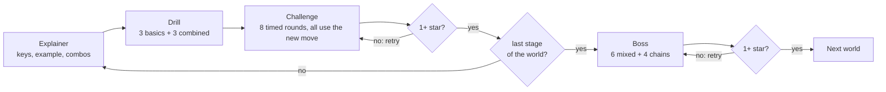

# Vim Dojo — Specification

**Status:** prototype spec, version 0.5 (2026-10-08). This file is the source of
truth for how the game behaves. How to change it: see [AGENTS.md](AGENTS.md).
Why things are the way they are: [docs/decisions/](docs/decisions/).

## 1. Summary

Vim Dojo is a Neovim plugin that teaches Vim motions as a game: learn one move,
drill it alone and combined with what you know, then beat a timed challenge in
which every round needs the new move. Each world ends with a boss that chains
several moves. Every round counts your keystrokes against **par**, the shortest
solution using the moves you know. Stumbling through still passes; mastery earns
stars.

The prototype has 13 stages and 4 bosses in four worlds, about 60 minutes of
play. It runs in a pinned, locked-down Docker container, or as a plugin in any
Neovim ≥ 0.12.

## 2. Background and inspiration

Vim Dojo started from trying two training plugins side by side, then borrowed
the teaching order and habit-breaking ideas from four more projects. Nothing is
copied; every source is credited in [docs/references.md](docs/references.md).

| Source | What we take | What we avoid |
| --- | --- | --- |
| [vim-be-good](https://github.com/ThePrimeagen/vim-be-good) | Time pressure that forces moves from memory; menu and rounds that feel like a game | Small scope (7 games); clumsy solutions pass if they are fast; `ci{` never explained |
| [nvim-training](https://github.com/Weyaaron/nvim-training) | Breadth (60+ tasks, topic collections); being strict about *how* a task is solved | Tasks that assume untaught combinations and feel like puzzles; no time pressure |
| vimtutor (Neovim `:Tutor`) | The lesson order (move, `x`, insert, `A`, operator + motion, counts, `dd`, `c`) and checking lines against expected text | Long reading; no scoring or repetition |
| [learn-vim](https://github.com/dofy/learn-vim) | Grouping motions by size (cell, word, line) and "estimate a count, then correct" | — |
| [hardtime.nvim](https://github.com/m4xshen/hardtime.nvim) | Hints that name a better command after an inefficient one; its recommended motion workflow | Blocking keys in everyday editing |
| [delaytrain.nvim](https://github.com/ja-ford/delaytrain.nvim) | Gently blocking a key that is repeated too often within a short time | — |

## 3. Goals and non-goals

Goals for the prototype:

- Prove the loop: explainer, drill, timed challenge, boss, with keystroke stars.
- Apply, don't repeat: every challenge round needs the stage's new move, and
  most combine it with moves learned before (docs/decisions/0008).
- Never a puzzle: no round needs a move the player has not been shown.
- Correct par every time: equal to the shortest solution using learned moves.
- After every round, show the intended solution and up to two alternatives in
  Vim key notation.
- Random rounds: distances, words and target characters differ every time.
- Saved progress; playable in the locked-down Docker container.

Non-goals for this version:

- Animated demos; key notation is enough.
- New moves beyond the 13 stages (text objects, search, yank/put, visual mode,
  registers and macros come later). Version 0.5 reworks the existing content
  after the first playtest instead of adding moves.
- Difficulty settings, sound, long-term statistics, spaced repetition.
- Personal Neovim configs and custom keymaps; the game assumes stock Neovim.
- Plain Vim.

## 4. Core loop

Each stage teaches one move in three steps; passing its challenge unlocks the
next stage. Each world ends with a boss; beating it opens the next world.

1. **Explainer.** One screen: what the move does, its keys in Vim notation, a
   before/after example, what it combines with, and a tip. Shown automatically
   the first time; can be reopened from the menu.
2. **Drill.** 6 untimed rounds in two parts: 3 *basics* that practise the new
   move on its own, then 3 *combined* rounds where it follows or joins a move
   you already know (`2je`, `jdw`). Free hints, no stage stars (each round still
   shows how close you were to par). Required once before the challenge.
   Stage 1.1 has nothing to combine with yet, so its drill is all basics.
3. **Challenge.** 8 timed rounds. **Every round needs the new move**, and 5 of
   them combine it with an earlier move (the rest are basics). Earns 0–3 stars;
   1 star unlocks the next stage.
4. **Boss** (end of each world). 10 timed rounds: 6 mixed rounds that combine
   at least two different moves, then 4 *chains* of 2–3 steps (go here, then
   change that, then go there). Mixed rounds take turns among the world's
   stages and need that stage's move, so each one comes up; stages that only
   move the cursor sit out while `h j k l` is the only motion (in World 1: `x`,
   `i a` and `A I` take turns). Every round needs at least one move from this
   world. Beating it (1 star) unlocks the next world. The summary shows how you
   did per move and names your weakest one.



**Skip ahead.** A world's boss can be played as soon as the world's first stage
is unlocked. Beating it unlocks every stage of that world and the next world,
so players who already know the basics don't have to grind them
(docs/decisions/0009). Any unlocked stage or boss can be replayed to improve its
stars; the best result is kept.

**What "combined" means.** The solver reports which move families its intended
solution uses (§9 Concept tags). A round is *combined* when that solution uses
the stage's move plus at least one other move family; counts alone don't count,
because they modify a move rather than add one (`3w` is a basic `w` round,
`2je` is a combined `e` round). Rounds that don't meet their requirement are
thrown away and regenerated.

## 5. Rounds

A round is one small task in a scratch buffer: reach a target or make an edit,
and the next round starts on its own.

**Task kinds.**

- *Move rounds:* put the cursor on the highlighted target. The buffer is
  read-only, so accidental edits fail and only cost keystrokes. Checked: cursor
  position.
- *Edit rounds:* make the text match the goal. The part to change is
  highlighted, and the goal line is shown as a ghost line under it. Checked:
  text only, so where the cursor ends up does not matter. Undo (`u`) is allowed
  and costs keys like anything else.
- *Combined rounds:* a basic round placed in a taller buffer, with the cursor
  starting on another line or further away, so the new move has to follow an
  earlier one (`3jA` for `A`, `2j$` for `$`). Some stages have their own
  combined rounds too, such as `df,` and `ct)` for `f` and `t`.
- *Chains* (bosses only): 2–3 steps on different lines of one buffer, each a
  move or an edit, done in order. Only the current step is highlighted and the
  header shows `step 2/3`; the text can be changed only during edit steps. The
  round ends after the last step. Its par is the sum of the steps' pars along
  the intended path, cursor and remembered column included (after `$`, `j`
  keeps to line ends), so finishing a step somewhere else can make a later step
  a key longer or shorter.

**Randomness.** Every round comes from a seeded generator: words from a word
list, start and target positions, distances, target characters. Constraints
keep rounds fair: prose lines hold only lowercase words and single spaces until
World 4 introduces code-like lines with punctuation. The seed is shown in the
summary, so any round can be reproduced.

**When a round ends.** The game checks the state after every key, but only in
Normal mode with no operator or count pending. A match is a success; running
out of time is a fail. So a move round succeeds the moment the cursor lands on
the target, and an edit round only after `<Esc>`.

**Counting keystrokes.** Each typed key counts as one, as written in Vim
notation: `3w` is 2, `f(` is 2, `cwbar<Esc>` is 6, `W` is 1. `:` commands count
every character including `<CR>`. Not counted: `<Esc>` pressed while already in
Normal mode, the game's control keys, and keys blocked by habit mode.

**Timer.** Challenges and bosses only. The limit is 4 s plus 0.7 s per key of
par: `3w` gets 5.4 s, `ct)foo<Esc>` gets 8.9 s, a chain with a total par of 14
gets 13.8 s. The countdown in the header turns to a warning color in the last
2 s, and each challenge or boss opens with a 3-2-1 countdown.

**Controls during a round.**

| Key | Action |
| --- | --- |
| `<Tab>` | Hint: shows the intended solution. In a challenge, that round can then earn at most 1 star. |
| `:q` | Back to the menu (it closes the play window; the header window becomes the menu). An unfinished drill or challenge is discarded. |

The play window's status line names both keys.

Everything else is plain Neovim, with relative line numbers on. Mouse clicks
and scrolling are ignored during rounds (keyboard only, and a click would beat
par). Leaving the game's tab stops the running drill or challenge, and `:Dojo`
during a round goes back to the menu.

**Habit mode** (after delaytrain.nvim). On by default; toggled with `H` in the
menu and saved (docs/decisions/0011). It acts only in challenges and bosses of
stages where counts are already learned (1.2 and later); drills stay forgiving.
Pressing the same one of `h j k l w b e` a third time within 1 s is blocked: the
key does nothing, is not counted, and the header suggests the counted form. The
character after `f`, `t`, `r` and similar is never blocked.

## 6. Scoring

Par is the fewest keystrokes that solve a round using only learned moves; stars
reward getting close to it without punishing a clumsy solve.

**Par and solutions.** A solver (§9) computes par for every round, the intended
solution, and up to two alternatives within par + 2 keys. Among equally short
solutions, the one using the round's own stage move is preferred. Every drill
and challenge round's intended solution must use the stage's move; rounds where
it doesn't are thrown away and regenerated (docs/decisions/0008). Once counts
are learned, alternatives that habit mode would block (`kkk`) are not shown.
Beating par with a move not yet taught is allowed and shown as "under par".

**Round stars.**

| Result | Stars |
| --- | --- |
| Solved in par keys or fewer, no hint | 3 |
| Solved in up to par + 2 keys, no hint | 2 |
| Solved with more keys, or with the hint | 1 |
| Time ran out | 0 |

**Challenge and boss stars.** The score is the average of the round stars
(0 to 3).

- 1 star (pass): at least 75 % of rounds solved (6 of 8; 8 of 10 for a boss).
  Unlocks the next stage, or for a boss the next world.
- 2 stars: pass, and a score of 2.0 or more.
- 3 stars: pass, and a score of 2.75 or more (for example 6 rounds at par and 2
  at par + 1).

**Habit hints** (after hardtime.nvim). Once counts are learned, a run of three
or more identical presses of `h j k l w b e x` in a round produces a hint naming
the counted form, for example `jjjj → 4j`. It appears with the round's result
and in the summary.

**Concept report** (bosses). Every round's intended solution is tagged with the
move families it uses. The boss summary lists each family that appeared in at
least two rounds with its average stars, and names the weakest one together with
the stage that teaches it.

**Feedback.** After a success the next round starts after 0.4 s; after a fail,
after 1.5 s. The result stays in the header during the next round: stars, your
keys, par with the intended solution, and up to two alternatives, for example
`✓ ★★☆ 3 keys · you www · par 2: 3w · also 3e`. Alternatives appear a moment
later, once computed. The summary after every drill and
challenge lists each round: your keys, the intended solution and alternatives.

## 7. Curriculum

The order follows vimtutor's first three lessons, regrouped by the size of the
move as learn-vim does, plus `f`/`t`, which vimtutor leaves out but every other
source treats as essential. Counts come right after `hjkl`, so par never
rewards pressing a key several times in a row (docs/decisions/0012). Explainer
texts are written for this game.

Distances stay *glanceable*: vertical targets use the relative line numbers (2
to 8 lines), word targets are at most 4 words away and character counts at most
4, so the count can be seen rather than counted. A round whose par uses the
same capped move three times (`4l4l4l`, `4l4ll4l`) is regenerated: it trains
patience, not a move.

**World 1 · First steps** (vimtutor lesson 1)

| Stage | Key | Keys | Round kind | Basic rounds | Combined rounds |
| --- | --- | --- | --- | --- | --- |
| 1.1 | `hjkl` | `h` `j` `k` `l` | move | Target 1 to 3 cells away, sometimes in two directions | none (nothing to combine with yet) |
| 1.2 | `counts` | `4j` `3l` | move | 2 to 8 lines up or down, or 2 to 4 cells sideways | both at once: `3j2l` |
| 1.3 | `x` | `x` `3x` | edit | Delete 1 to 4 highlighted stray letters | reach them first: `j2lx` |
| 1.4 | `insert` | `i` `a` | edit | Insert a missing word or letters next to the cursor | reach the spot first: `3li…` |
| 1.5 | `append` | `A` `I` | edit | Add a missing word at the end or start of the line | on another line: `2jA…` |
| 1.B | `boss_1` | — | mixed, chains | | |

**World 2 · Words and lines** (vimtutor 2.3–2.4, learn-vim chapter 1)

| Stage | Key | Keys | Round kind | Basic rounds | Combined rounds |
| --- | --- | --- | --- | --- | --- |
| 2.1 | `word` | `w` `b` | move | Start of a word 1 to 4 words away | on another line: `2j3w` |
| 2.2 | `word_end` | `e` | move | Last letter of a word 1 to 4 words ahead | `je`, `we` |
| 2.3 | `line_edges` | `0` `^` `$` | move | Start, first non-blank (indented lines) or end of the line | `3j$`, `k^` |
| 2.B | `boss_2` | — | mixed, chains | | |

**World 3 · Operators** (vimtutor 2.1–2.6, 3.3–3.4)

| Stage | Key | Keys | Round kind | Basic rounds | Combined rounds |
| --- | --- | --- | --- | --- | --- |
| 3.1 | `delete` | `dw` `de` `d$` `d0` `db` `d2w` | edit | Delete a span that one learned motion covers (operator + motion is already a combination) | reach it first: `jwdw` |
| 3.2 | `change` | `cw` `ce` `c$` | edit | Replace a word or line end with the goal text; the explainer covers `cw` acting like `ce` | `2jcw…` |
| 3.3 | `lines` | `dd` `3dd` `cc` `dj` | edit | Delete or rewrite 1 to 4 whole lines | from another line: `2jdd` |
| 3.B | `boss_3` | — | mixed, chains | | |

**World 4 · Find in the line** (learn-vim chapter 2, hardtime's workflow)

| Stage | Key | Keys | Round kind | Basic rounds | Combined rounds |
| --- | --- | --- | --- | --- | --- |
| 4.1 | `find` | `f` `F` | move | A character 6 to 40 columns away on a code-like line | with operators: `df,` `cf)…`; or `jf(` |
| 4.2 | `till` | `t` `T` | move | The cell just before or after a punctuation mark | with operators: `dt,` `ct)…`; or `kt;` |
| 4.B | `boss_4` | — | mixed, chains | | |

The old stage 4.3 ("operators meet find") is gone: its rounds are now the
combined rounds of 4.1 and 4.2 and part of the World 4 boss.

Long hops with `l` stop being the best answer once `w`, `e` and `f` arrive. The
solver picks that up on its own, so older moves get harder in later rounds
without extra content.

## 8. Screens

All screens are plain text inside Neovim, in their own tab page, laid out to
fit an 80 × 24 terminal. Layouts show content and placement, not final wording.

**Menu.** Opens with `:Dojo`. `j`/`k` (and `gg`/`G`) move between stages;
`<CR>` continues the stage from where it is: explainer, then drill, then
challenge (bosses: explainer, then the boss). Returning to the menu puts the
cursor back on the stage just played. The key help sits in the status line so
all 17 entries fit in 22 rows.

```
 VIM DOJO                                   12 / 51 ★   habit mode: on
 World 1 · First steps
     1.1  h j k l     Move by cells          ★★★
     1.2  counts      Repeat with a count    ★★☆
     1.3  x           Delete characters      ★☆☆
     1.4  i a         Insert text            ☆☆☆   new
     1.5  A I         Add at line ends       locked
     1.B  Boss        Mixes and chains       ☆☆☆   skip ahead
 World 2 · Words and lines
     2.1  w b         Jump by words          locked
 ...
 <CR> play  d drill  c challenge  ? explainer  H habit mode  q quit   (status line)
```

**Explainer.** One screen per stage; brackets mark the cursor in examples.
Every screen's key help sits in the window's status line.

```
 2.1  w b  ·  Jump by words

 w     forward to the start of the next word
 b     back to the start of the previous word

 Example
   before  [t]he quick brown fox jumps
   type    ww
   after   the quick [b]rown fox jumps

 Combines with
   3w      counts: three words
   2j3w    down two lines, then three words

 Tip: count the word starts, not the letters.

 <CR> start the drill   q menu                               (status line)
```

**Boss explainer.** Lists the world's moves, what the rounds look like and a
"which move when" guide (after hardtime.nvim's recommended workflow): up/down
with a count and `j`/`k`, a few cells with `h`/`l`, word starts and ends with
`w b e`, line edges with `0 ^ $`, a specific character with `f t`.

**Round.** The header sits in its own window above the play buffer; it cannot
be focused or edited. Its first line names the part: `Drill · basics`,
`Drill · combined`, `Challenge`, or for bosses `mixed` or `chain`; in chains the
prompt starts with `Step 2/3:`. The play buffer holds only the task text, with
relative line numbers. The target is highlighted (not visible in this sketch).

```
 2.1 w b · Challenge          round 3/8          par 2       4.2 s left
 Move to the highlighted character
 Learned: h j k l  x  i a  A I  w b
 Last: ✓ 3 keys · par 2 · ★★ · intended 2w
 ───────────────────────────────────────────────────────────────────
   2  lorem ipsum dolor sit amet consectetur adipiscing
   1  elit sed do eiusmod tempor incididunt ut labore
   3  et dolore magna aliqua ut enim ad minim veniam
```

**Summary.** After every drill, challenge and boss; the main learning moment.
A boss summary adds the concept report:

```
 Moves          rounds   stars
 w b               4     ★★★
 e                 3     ★★☆
 0 ^ $             3     ★☆☆   weakest: replay 2.3
```

A stage summary looks like this:

```
 2.1 w b · Challenge complete                      ★★☆   score 2.25

 Solved 7/8 · at par 4/8 · average 3.4 s · seed 48121

  #  your keys       par  intended       also works        stars
  1  3w              2    3w             www               ★★★
  2  jjww            3    j2w            jww               ★★☆
  3  bbbb            2    4b             –                 ★☆☆  bbbb → 4b
  4  ww              4    2j2w           –                 time out
  …

 n next stage   r retry   m menu                             (status line)
```

## 9. Technical design

A Neovim plugin in plain Lua with no dependencies, built and played inside a
pinned Docker container.

**Platform.** Neovim 0.12.5, pinned and checksum-verified in the Docker image
and in CI. Lua only. Inside the container: stock config, relative line numbers,
no mouse.

**How par is found.** The solver runs candidate keys for real in a hidden
scratch buffer (`normal!`) and searches outward from the start, cheapest first
(uniform-cost search), until it reaches the goal. This avoids re-implementing
Vim's motion rules, which is where hand-written par goes wrong (`cw` acting like
`ce`, `e` on one-letter words, `j` keeping the column after `$`).

- Cost is counted in keys, not commands: a count prefix costs its digits. (A
  first test that counted commands found `2k9b` where `3kw` is a key shorter.)
- State is the text, cursor and wanted column (`curswant`), so `$` then `j` is
  modelled correctly.
- Candidates are only learned moves and `f`/`t` targets taken from characters
  on the current line (not space). Counts are 2–9 for `j k w b e`, where
  relative numbers and word starts make them easy to see, but only 2–4 for
  `h l x`: nobody counts letters at a glance, and `7x` should not beat `dt,`
  ([decision 0007](docs/decisions/0007-count-limits.md)).
- Commands that end in Insert mode (`i a A I c…`) are tried as finishers: the
  solver inserts a sentinel to learn where typing would start and works out the
  text to type from the goal. Generators therefore only describe goal text.
- Edits are only tried on the lines being changed and near the changed columns;
  after an edit the text must still be "goal prefix + rest + goal suffix",
  otherwise the branch is dropped.
- Pruning keeps it fast: a lower bound on the keys still needed (a change
  needs at least a command, the new text and `<Esc>`) drops hopeless branches;
  once `c` is learned, delete-then-insert is not explored; operators with
  `f`/`t` only target characters at the edges of the changed text.
- Charwise operators (`d`/`c` with `h l w b e f t`) must leave every other
  line alone: `0kcb`, which changes the end of the line above through Vim's
  exclusive-motion rule, is legal but never the intended solution.
- Ties are broken by: uses the round's focus move, then fewer commands, then
  smaller counts (`2kwd$` over `09bd$`, which wraps nine words across lines),
  then key order.
- **Concept tags.** Every candidate key carries the move families it uses
  (`d2w` uses `d`, `w b` and counts), so a solution's families are known. That
  is what checks "uses the new move", "combined" and "uses a move from this
  world", and what the boss concept report is built on.
- Alternatives: the same search with the intended solution's main move banned,
  and with counts banned.
- Measured on 0.12.5: most rounds take under 20 ms; the slowest are combined
  rounds in World 3, where every `d`/`c` motion is a candidate, and World 4
  chains, both up to about 350 ms. Rounds are generated one ahead, during the
  pause between rounds.

**What happens in a round.**

1. The session plans the rounds (basic, combined, mixed or chain) and asks the
   stage's generator for a task: its basic generator, its own combined
   generator if it has one, or the basic task passed through the generic
   *combine* step (taller buffer, cursor moved away). Half of the single-line
   rounds from a stage's own combined generator go through the combine step
   too, so `dt,` also comes as `2jdt,`. Chains stack single-line
   tasks from several stages on separate lines of one buffer.
2. The solver returns par, the intended solution, its concept tags and
   alternatives. The session retries generation if a requirement fails: no
   solution within the cost limit, the new move missing, "combined" not met,
   no move from the boss's world, or a clunky par (§7). Chains are solved step
   by step along the intended path, each step within its own cost limit.
3. The round runner shows the buffer and header, records typed keys with
   `vim.on_key`, runs the timer, and checks the state after each key.
4. The scorer turns keys, time and hint use into round stars and habit hints;
   the session adds them up.
5. Progress is saved after every finished drill or challenge.

**Code layout.**

| Path | Responsibility |
| --- | --- |
| `plugin/dojo.lua` | Defines `:Dojo` |
| `lua/dojo/init.lua` | `setup(opts)` and `open()` |
| `lua/dojo/config.lua` | All tunable defaults (§10) |
| `lua/dojo/curriculum.lua` | Worlds, stages, bosses, their order, display ids, learned moves, unlock rules |
| `lua/dojo/stages/<key>.lua` | One file per stage, named by its stable key: explainer and round generators (`boss.lua` builds the four bosses, `util.lua` helpers) |
| `lua/dojo/compose.lua` | The generic combine step and chain building |
| `lua/dojo/solver.lua` | Par, intended solution, alternatives |
| `lua/dojo/moves.lua` | Move families and the candidate keys they allow |
| `lua/dojo/round.lua` | One round: buffer, key capture, habit mode, timer, completion check |
| `lua/dojo/session.lua` | Drill, challenge and boss sequencing, round requirements |
| `lua/dojo/score.lua` | Star rules, habit hints, concept report |
| `lua/dojo/ui/*.lua` | Layout, menu, explainer, header and summary screens |
| `lua/dojo/progress.lua` | Saving and loading progress, round log |
| `lua/dojo/rng.lua`, `words.lua`, `text.lua`, `keys.lua` | Seeded random numbers, word list, line builders, key display |
| `tests/` | Headless test suite (`nvim -l tests/run.lua`) |
| `docker/`, `compose.yaml` | Container image and services |

**Stage files** are the main extension point. Each returns a table with `key`
(stable, used for saved progress; display ids like `2.1` come from the order),
`title`, `name`, `kind`, `adds` (move families it teaches), `focus` (which
families a solution must use), `explainer` (with `combos`), `generate(rng, ctx)`
for basic rounds and optionally `combined(rng, ctx)`. A generator returns
`{kind, lines, cursor, goal}` where `goal` is a cursor for move rounds or goal
lines for edit rounds, plus a one-line `prompt`. `ctx` says which families are
learned and the mode. Single-line tasks can serve as chain steps.

**Saved data** lives in `stdpath('data')/dojo/`. `progress.json` (version 2)
holds, per stage key: explainer seen, drill done, best stars, best score,
attempts; plus settings (habit mode). Version 1 files, keyed by the old stage
numbers, are migrated on load: each stage keeps its stars under its new key,
old 4.3 is dropped (docs/decisions/0010). `rounds.jsonl` logs every round
(stage, mode, round kind, seed, keys, par, concepts, time, result).

**Unlock rules.** A stage is unlocked when it is the first one, when the entry
before it (stage or boss) has at least 1 star, when it has a star itself (for
example after migration), when it was open in a version 1 save, or when its
world's boss has been beaten. A boss is unlocked as soon as its world's first
stage is.

**Docker.** No network, read-only filesystem, no capabilities, non-root user, a
data volume. The plugin is copied from the repo at build time. Services:
`dojo` (play), `dev` (repo mounted read-only, no rebuild needed), `test` (runs
the suite).

**Tests** run headless with `nvim -l tests/run.lua`, a small runner of our own.

- Every stage, 200 seeds per round kind (basic, combined): the intended
  solution replays to the goal and is par keys long; it uses the stage's move;
  combined rounds use another move family as well. For 10 rounds per stage,
  every alternative replays too. Replays use `normal!`; real typed keys are
  covered by the round runner tests.
- Every boss, 50 mixed rounds and 50 chains: each uses a move from its world,
  mixed rounds combine two move families, and chains replay step by step.
- Progress migration from version 1, unlock rules including skip ahead, and the
  concept report's weakest move.
- Solver cases with known answers (`3w`, `$`, `3kw`, `dt,`, `cebar<Esc>`).
- Round runner: keys fed with `nvim_feedkeys`, asserting key count, success,
  timeout and habit-mode blocking.
- Star rules, unlock rule, saving then loading progress.
- Generation time per round: the budget is 400 ms; the test fails above
  800 ms (per step in chains) to allow for slow CI machines, and prints the
  slowest round.
- The game leaves the user's session alone: registers, last `f`/`t` search
  and clipboard setting survive the solver; no stray buffers or keymaps.

**CI** (GitHub Actions): the test suite on the pinned Neovim, and a Docker build
that runs the suite inside the image.

## 10. Tunable defaults

Every number that shapes difficulty lives in `lua/dojo/config.lua`, overridable
through `require("dojo").setup()`, because playtesting will move most of them.

| Setting | Default |
| --- | --- |
| Drill rounds | 3 basics + 3 combined |
| Challenge rounds | 8, all with the new move, 5 of them combined |
| Boss rounds | 10: 6 mixed + 4 chains of 2, 2, 3 and 3 steps |
| Time limit per timed round | 4 s + 0.7 s per par key |
| Warning color | last 2 s |
| 2-star round | up to par + 2 keys |
| Pass (1 star, unlocks the next entry) | 75 % of rounds solved |
| 2-star challenge | pass and score ≥ 2.0 |
| 3-star challenge | pass and score ≥ 2.75 |
| Hint in a challenge or boss | round earns at most 1 star |
| Pause after a success / fail | 0.4 s / 1.5 s |
| Habit mode | on in challenges and bosses once counts are learned; blocks the 3rd press within 1000 ms |
| Habit hint | run of 3+ identical presses |
| Word and character distances | up to 4 |
| Solver cost limit | 10 keys for move rounds, 16 for edit rounds, 12 per chain step |
| Counts the solver tries | 2–9 for `j k w b e`, 2–4 for `h l x` |
| Seeds per stage in tests | 200 per round kind |

The number of combined rounds in a challenge is the main lever for a future
difficulty setting.

## 11. Acceptance criteria

Version 0.5 is done when all of these hold:

- [ ] `docker compose run --rm dojo` opens the menu; on first start only stage
  1.1 and the World 1 boss are unlocked; all 17 entries fit at 80 × 24.
- [ ] All 13 stages play end to end: explainer, drill (basics then combined),
  challenge, summary; all 4 bosses: explainer, boss, summary with concept
  report.
- [ ] Every challenge round uses the stage's move; at least 5 of 8 are combined
  where the stage can combine; boss rounds use a move from their world.
- [ ] Chains highlight one step at a time and end after the last step.
- [ ] Beating a boss unlocks its world and the next one; progress from version
  0.4 keeps its stars.
- [ ] After every round and in every summary: your keys, the intended solution
  and alternatives.
- [ ] Test suite passes locally and in CI, including the 200-seed stage tests
  and the boss tests; solver within budget.
- [ ] A full playthrough leaves no errors in `:messages`.
- [ ] Habit mode is on by default, blocks only in challenges and bosses where
  counts are learned, and can be turned off with `H`.

## 12. Open questions

- **License.** The repo is public but has no license yet, so by default nobody
  may reuse it. All referenced projects are permissive (CC0, MIT, Apache-2.0,
  Vim license) and no code or text was copied. Owner's choice; MIT or Apache-2.0
  would match the references.

Resolved questions from version 0.1 are recorded in
[docs/decisions/0006-prototype-defaults.md](docs/decisions/0006-prototype-defaults.md).

## 13. After the prototype

If playtesting confirms the loop, later worlds reuse the engine and only add
stage files:

1. Put, replace, yank and open lines: `p` `r` `R` `y` `o` `O` (vimtutor 3, 6).
2. Text objects: `iw` `aw` `i"` `i(` `i{` `it`, including `ci{` (vimtutor
   chapter 2, learn-vim chapter 8).
3. Search and jumps: `/` `?` `n` `N` `*` `#` `%` `gg` `G`.
4. Repeating: `.`, `;` and `,`; then visual mode `v` `V`.
5. Registers and marks, then macros.
6. Bigger moves: `W` `B` `E` with punctuation, `ge`, `{` `}`.

Alongside: difficulty tiers (more combined rounds, longer chains, a tighter
clock), a habit report across sessions from the round log (like
`:Hardtime report`), and practice rounds built from your weakest moves, which
the boss concept report already identifies.

## Spec history

| Version | Date | Change |
| --- | --- | --- |
| 0.1 | 2026-10-07 | First prototype spec (10 stages, two worlds), reviewed as a doc |
| 0.2 | 2026-10-07 | Moved into the repo; curriculum reordered after vimtutor (14 stages); habit mode and hints; solver details; CI |
| 0.3 | 2026-10-07 | From building and the first playtest: count limits for `h l x`, solver pruning, `:q` and menu focus behavior, stage file names |
| 0.4 | 2026-10-07 | From an independent code review: full per-round feedback, mouse ignored, leaving the tab stops a round, two-step rounds need two moves, test wording matches what is tested |
| 0.5 | 2026-10-08 | From the owner's playtest (docs/playtests/2026-10-08-owner.md): every challenge round uses the new move and most combine it; drills get a combined part; bosses with chains, skip ahead and a concept report; counts move to 1.2; `dd` becomes a whole-lines stage after `c`; 4.3 folded into 4.1/4.2; tighter clock; glanceable distances; habit mode on by default in challenges; stable stage keys with progress migration |
